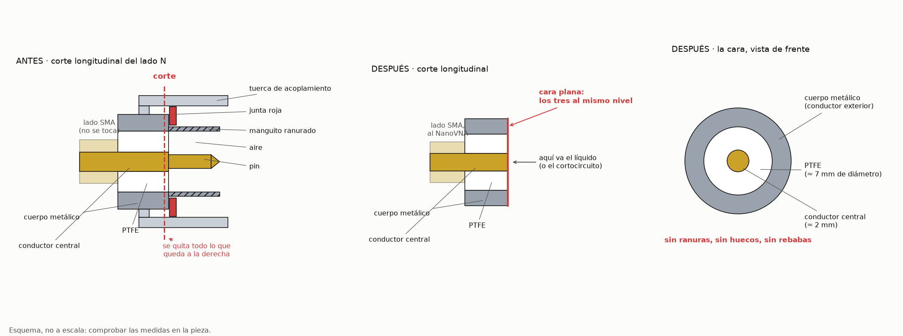

# Sonda v1: adaptador rígido SMA macho – N macho

Sonda de pruebas para poner en marcha la cadena de medida con líquidos. Sigue la idea de
González-Teruel et al. (2022), que mecanizaron un adaptador SMA-N para usar el lado N como apertura.

**Estado:** por comprar, sin fabricar. Las dimensiones están por anotar cuando llegue la pieza.

## Qué es

| Elemento | Descripción |
|---|---|
| Pieza | Adaptador coaxial rígido, de una pieza, SMA macho a N macho (TUOLNK, 2 unidades; Amazon, B0BGSB1PQH) |
| Apertura | El lado N, rebajado hasta dejar una cara plana |
| Conexión al equipo | El SMA macho se enrosca directamente en el puerto 1 del NanoVNA, **sin cable** |
| Cables | No forman parte de la sonda. Se intercalan después latiguillos SMA macho–hembra de distinto tipo y longitud para medir su efecto |

Se descartó como primera opción un conector N ya montado sobre un latiguillo RG316 de 10 cm
(AliExpress, artículo 1005005675030068): el adaptador rígido tiene un cuerpo macizo más fácil de
rebajar y permite empezar sin cable, que es una fuente de error menos.

Con dos unidades hay una de repuesto para aprender a rebajarla y, más adelante, una segunda sonda
para comprobar la reproducibilidad entre sondas.

## Por qué un conector N

- **Más sensibilidad a baja frecuencia.** La apertura de un N (unos 7 mm) tiene bastante más capacidad
  que la de un SMA o un semirrígido de 0,141″, así que el coeficiente de reflexión se aparta antes de 1.
- **Antecedente directo.** González-Teruel et al. midieron con una sonda de este tipo y un nanoVNA-H:
  conductor interior de 2,3 mm, conductor exterior de 7,3 mm (interior) y 12 mm (exterior), y una
  profundidad de penetración de 1,5 mm a 100 MHz y 1,3 mm a 900 MHz. Dieron por fiable la banda de
  50 a 500 MHz.
- **Coste y disponibilidad.**

## Limitaciones previstas

- **Banda alta.** Con una apertura de este tamaño y líquidos de permitividad alta, el modelo capacitivo
  deja de valer antes: en agua, mi estimación es que por encima de unos 400–500 MHz la apertura ya no
  es pequeña frente a la longitud de onda. González-Teruel et al. describen además resonancias de la
  brida hacia 1 GHz con líquidos de permitividad alta y pocas pérdidas.
- **Montaje sin cable.** Con el adaptador enroscado al puerto, el equipo tiene que quedar vertical y
  fijo, con la sonda hacia abajo, y es el vaso el que sube. Al intercalar un latiguillo, hay que
  fijarlo y no tocarlo entre la terna de calibración y las muestras.
- **Volumen de muestra.** Más apertura pide más líquido alrededor: González-Teruel et al. usaron un
  portamuestras de 29 mm de diámetro y 30 mm de altura.
- **Tejido.** Para muestras sólidas hace falta una cara plana; con huecos de aire no sirve.

Para la parte alta de la banda (hasta 1,45 GHz) y para tejido sigue prevista una sonda de apertura
pequeña (semirrígido de 0,141″ o SMA de panel), que sería la v2.

## Fabricación

Descripción a partir de la foto del producto; la pieza no se ha visto por dentro, así que el primer
paso es comprobar que coincide.

El esquema se regenera con `esquema_rebaje.py`. No está a escala.

### Cómo es el lado N macho, de fuera hacia dentro

1. **Tuerca de acoplamiento:** el anillo moleteado, giratorio y con rosca interior. Va retenida al
   cuerpo por un anillo o alambre elástico; la muesca ovalada que se ve en su parte trasera es por
   donde se introduce.
2. **Junta roja** de goma, en el fondo de la tuerca.
3. **Contacto exterior:** un manguito metálico fino, ranurado en lengüetas, de unos 8 mm de diámetro.
4. **Aire** entre el manguito y el pin, a lo largo de varios milímetros.
5. **Pin central,** con la punta cónica, que llega casi hasta el borde del manguito.
6. **PTFE:** empieza en el fondo del manguito. Ahí el conductor central suele ensanchar (González-Teruel
   et al. midieron 2,3 mm de conductor interior y 7,3 mm de diámetro del PTFE).

### Qué hay que conseguir

Una cara plana en la que el conductor central, el anillo de PTFE y el cuerpo metálico queden al mismo
nivel. Eso significa eliminar la tuerca, la junta, todo el manguito ranurado y la parte del pin que
sobresale, y cortar justo por debajo de donde empieza el PTFE.

### Pasos

1. **Medir antes de cortar.** Con la varilla de profundidad del calibre, la distancia desde el borde
   del manguito hasta la cara del PTFE. Es la longitud que hay que quitar, más medio milímetro.
2. **Proteger el lado SMA** con cinta y sujetar la pieza por el cuerpo, nunca por el SMA.
3. **Quitar la tuerca y la junta roja.** Sacar el anillo de retención por la muesca; si no sale, cortar
   la tuerca.
4. **Cortar el manguito y el pin** a la altura de la cara del PTFE, con sierra fina o disco de corte,
   girando la pieza y sin forzar el pin hacia los lados. No debe quedar nada de las ranuras.
5. **Rebajar medio milímetro más,** ya dentro del PTFE, para que la cara sea maciza.
6. **Lijar a escuadra** sobre un cristal con lija al agua de grano 400, 1000 y 2000, haciendo ochos. Para
   mantener la perpendicular, pasar la pieza por un taladro ajustado en un taco.
7. **Quitar rebabas** del borde del conductor central y del cuerpo, e inspeccionar con lupa.
8. **Comprobar con el polímetro:** sin continuidad entre el conductor central y el cuerpo; con
   continuidad entre el conductor central de la cara y el pin del SMA.
9. **Limpiar** con isopropanol, **medir** los tres diámetros y **fotografiar** la cara.

Precauciones: gafas, cortar despacio y sin calentar (el conductor central puede ir a presión y
soltarse), y recordar que el corte deja latón al descubierto, que se corroe con disoluciones salinas.

Sin rebajar, el líquido entra en el hueco del conector. Para una primera comprobación de que la
cadena funciona puede valer, pero quedan burbujas atrapadas, es difícil de limpiar entre líquidos y
el modelo de la sonda deja de ser el de una apertura plana. No sirve para tomar datos.

## Cables como factor experimental

Una vez que la sonda funcione enroscada al puerto, se intercalan latiguillos entre el equipo y la
sonda para cuantificar lo que añaden. El orden previsto:

| Configuración | Qué responde |
|---|---|
| Sin cable | Referencia: lo que dan el equipo y la sonda |
| Latiguillo corto y rígido o semirrígido | Coste mínimo de separar la sonda del equipo |
| RG316 de 10 cm, fijo | Efecto de un cable flexible sin moverlo |
| El mismo cable, flexionado de forma controlada | Error por movimiento, que es el factor «cable» del protocolo |
| Cables más largos o de otro tipo (RG58, RG174) | Cómo escala con la longitud y la calidad del cable |

Cada latiguillo se anota en `hardware/README.md` con tipo, longitud y conectores.

## Calibración de la sonda

La terna prevista es cortocircuito, aire y agua. Con una apertura de 7 mm el cortocircuito es más
difícil de hacer bien que con una sonda pequeña: hay que presionar una lámina metálica contra toda la
cara. Su repetibilidad es lo primero que hay que medir.

González-Teruel et al. evitaron el cortocircuito calibrando con aire, agua y un tercer líquido
(metanol). Es una alternativa si el corto no se repite bien; hoy `lcds.probe` solo admite la terna
con cortocircuito.

## Dimensiones medidas

| Magnitud | Valor (mm) | Fecha |
|---|---|---|
| Ø conductor interior | | |
| Ø interior del conductor exterior | | |
| Ø exterior del conductor exterior | | |
| Longitud rebajada | | |

## Referencia

González-Teruel, J. D., et al. (2022). Measurement of the broadband complex permittivity of soils in
the frequency domain with a low-cost vector network analyzer and an open-ended coaxial probe.
*Computers and Electronics in Agriculture*, 195, 106847. doi:10.1016/j.compag.2022.106847
